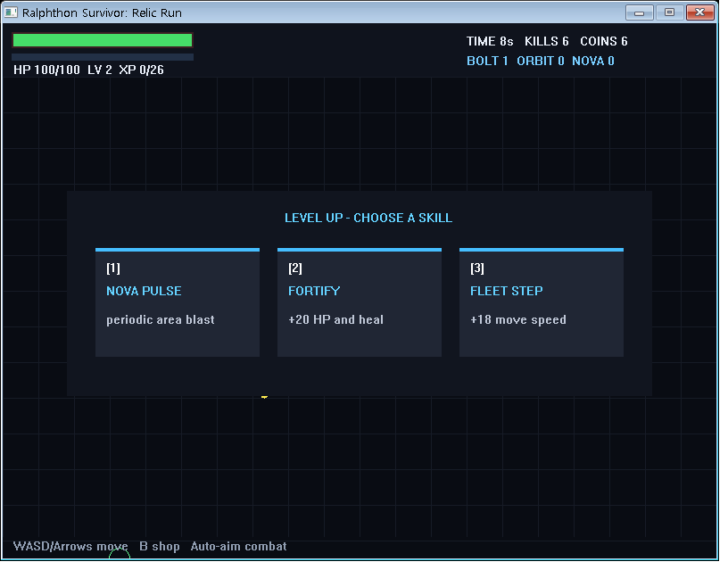
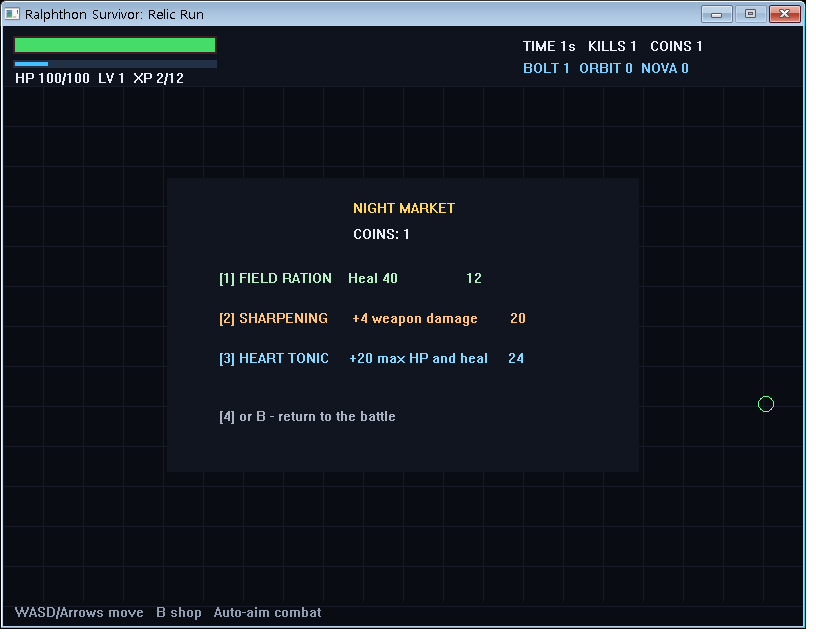
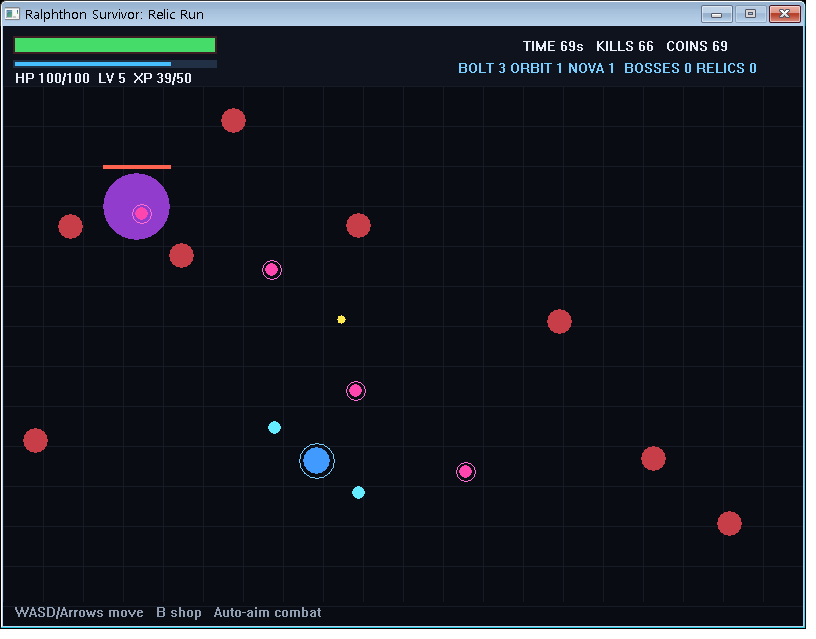
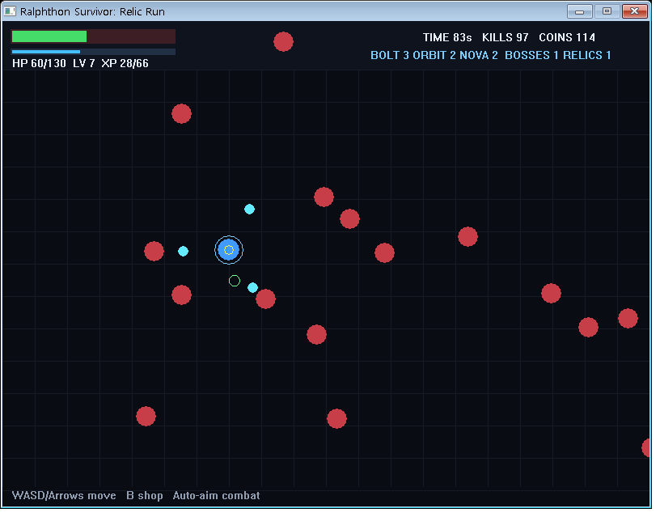
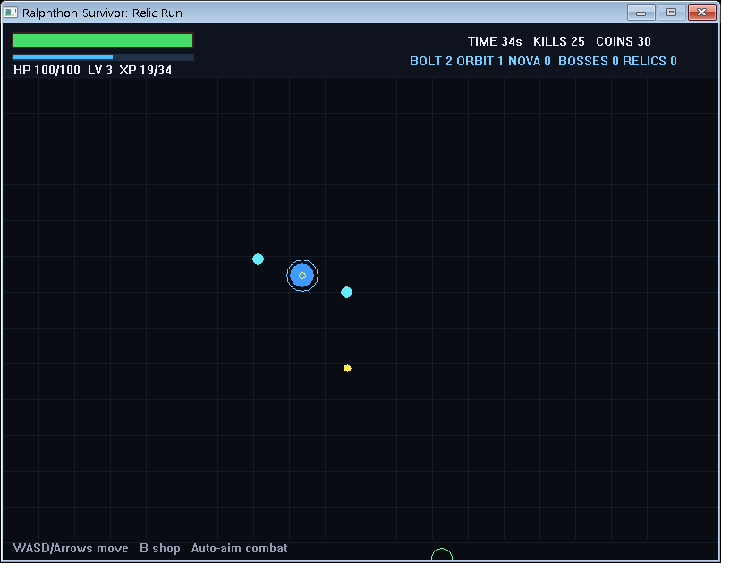

# 노트북 한 대, 50분, 33KB — 원 펀치 랄프톤 in Busan 참가 후기

## 대회 정보

- 일시: 2026년 7월 16일 13:00~18:00
- 장소: 패스파인더 초량점 2층
- 주최·주관: 과학기술정보통신부·정보통신산업진흥원, 부산광역시, 부산정보산업진흥원
- 형식: Codex 에이전트 루프 해커톤 + 지역 개발자 네트워킹
- 프로젝트 주제 모티브: [1.44MB GAME_DEV CONTEST](https://2pgarcade.com/contest-144mb.html)

결론부터 적으면 이렇다. 4명이 노트북 한 대로 참가해서, Codex에게 50분을 맡겼고, 33,792바이트짜리 Windows 게임 실행파일 하나를 받았고, 우수상을 받았다.

| 항목 | 결과 |
|---|---:|
| 팀명 | 랄먹 — "랄프로 날로 먹자" |
| 인원과 장비 | 4명, 노트북 1대 |
| 준비 시간 | 약 1시간 30분 (주제 선정 + 하네스 문서 작성) |
| 에이전트 실행 | Codex `/goal`, 약 50분 |
| 결과물 | Windows 네이티브 액션 로그라이트 EXE 1개 |
| 최종 크기 | 33,792 / 1,474,560바이트 (플로피 한 장의 약 2.3%) |
| 외부 엔진·에셋·런타임 | 없음 |
| 수상 | 우수상 |

숫자만 보면 깔끔해 보이지만, 시작은 전혀 깔끔하지 않았다.

## 노트북이 한 대뿐이었다

원 펀치 랄프톤은 Codex 에이전트 루프로 결과물을 만들면서 지역 개발자들과 네트워킹하는 행사였다. 참가자를 위한 미니 강의도 있었고, 주제는 "Codex로 만들 수 있는 모든 것". 자유도가 높은 만큼 무엇을 만들지가 곧 전략이었다.

문제는 우리 팀이 장비 분담을 미리 맞춰보지 못한 채 모였다는 것이다. 현장에서 확인해보니 쓸 수 있는 컴퓨터가 한 대뿐이었다. 나는 어떤 행사든 현장에 아무것도 없을 수 있다는 가정으로 움직이는 편이라 만약을 대비해 노트북을 챙겨갔는데, 그 습관이 아니었으면 정말 구경만 하다 올 뻔했다. 팀명 '랄먹'은 "랄프로 날로 먹자"는 농담으로 지은 건데, 시작부터 정말로 랄프에게 거의 모든 것을 맡겨야 하는 상황이 됐다.

주제 선정도 한참 헤맸다. 다른 팀들이 큰 서비스와 다양한 기능을 이야기하는 게 들렸고, 같은 방향으로 가면 노트북 한 대인 우리가 눈에 띌 방법이 없었다. 그래서 질문을 뒤집었다. 더 큰 것을 만들 수 있을까가 아니라, 더 작은 한계를 끝까지 지킬 수 있을까.

## 플로피 디스크 한 장이라는 제약

모티브로 삼은 것은 1997년 하이텔 게임제작 동호회의 100KB 게임 공모전에서 출발한 [1.44MB 게임 개발 공모전](https://2pgarcade.com/contest-144mb.html)이다. 규칙이 단순하고 강렬하다.

- 압축 해제 후 전체 용량 1,474,560바이트 이하
- 엔진은 자유지만 실행파일과 런타임까지 모두 용량에 포함
- 웹브라우저 게임 금지, 독립 실행파일로 플레이 가능해야 함
- 완성 여부, 용량 준수, 재미로 심사

3.5인치 HD 플로피 디스크의 실제 물리 용량 안에 게임 전체를 넣으라는 조건이다. 이 규칙을 그대로 우리 랄프톤 과제로 가져왔다. 장르는 짧은 시간 안에 시작-사망-성장-재시작을 다 보여줄 수 있는 뱀파이어 서바이버류로 정했고, 목표를 한 문장으로 못 박았다.

> Codex가 50분 동안 랄프 루프를 돌며, 1,474,560바이트 이하의 Windows 독립 실행형 액션 로그라이트를 완성한다.

## 코드보다 하네스를 먼저 만들었다

준비 시간 1시간 30분 동안 코드는 한 줄도 쓰지 않았다. 대신 네 명이 붙어서 Codex가 따라야 할 규칙 문서를 만들었다. 에이전트에게 "게임을 잘 만들어줘"라고만 하면 구현은 시작하겠지만, 언제 검증하고 언제 멈춰야 하는지는 알 수 없다. 그래서 역할을 파일로 쪼갰다.

| 문서 | 역할 |
|---|---|
| `AGENTS.md` | 작업 원칙, 금지 사항, 랄프 루프 1회의 정의 |
| `GOAL.md` | 최종 목표와 완료 조건 |
| `PLAN.md` | 50분을 단계별로 나눈 우선순위와 범위 축소 규칙 |
| `plan/BACKLOG.md` | 매 루프에서 고를 수 있는 실행 단위 |
| `PACKAGE.md` | 정확한 빌드 명령과 1,474,560바이트 패키징 규칙 |
| `TEST.md` | 빌드·실행·입력·2분 안정성·의존성 검증 게이트 |
| `PROGRESS.md` | 이전 루프의 결과, 증거, 다음 작업 |

기술 스택도 일부러 좁혔다. C99, MinGW-w64 GCC, Win32 API와 GDI만 허용. SDL도, 게임 엔진도, 이미지·폰트·사운드 파일도 없다. 프레임 중 동적 할당을 금지하고 적·투사체·효과를 전부 고정 크기 배열로 관리하게 했다.

이건 코드 골프를 하자는 게 아니었다. 용량 제한을 마지막에 확인하는 체크리스트가 아니라 첫 번째 아키텍처 결정으로 쓰자는 것이었다. 엔진을 고르고 나서 용량을 줄이는 게 아니라, 처음부터 런타임과 에셋이 필요 없는 구조를 고르면 용량 문제는 대부분 사라진다. 대신 크기 측정은 모든 루프에서 도는 회귀 테스트로 넣었다. 이 대회에서는 용량을 한 번이라도 넘는 순간 기획 자체가 무너지기 때문이다.

루프 하나는 이렇게 닫히게 했다. 백로그에서 검증 가능한 작업 하나를 고르고, 최소 변경으로 구현하고, 실제 릴리스 명령으로 빌드하고, EXE를 직접 실행해 확인하고, 바이트 수와 DLL 의존성을 검사한다. 실패하면 새 기능을 쌓지 않고 같은 검증을 다시 한다. 성공 증거가 있을 때만 완료 처리한다.

## 50분의 에이전트 룸, 그리고 11분 만의 "완료"

준비를 마치고 에이전트 룸에 들어가 Codex에서 `/goal`을 실행했다. 원칙은 50분 동안 사람이 코딩에 개입하지 않는 것이었다.

그런데 첫 결과물이 약 11분 만에 나왔다. 이동, 자동 공격, 적 스폰, 충돌, 강화, 게임오버와 재시작까지 갖춘 MVP였고 크기는 26,624바이트. 기능만 보면 완료 조건을 만족했다. 문제는 에이전트가 남은 시간을 쓰는 대신 목표를 "완료"로 판단하고 루프를 닫아버렸다는 것이다.

원인은 우리 쪽에 있었다. 문서에 "재귀적으로 완성도를 높여라"라고 적어두긴 했는데, 무엇이 더 완성된 상태인지는 정의하지 않았다. 사람끼리는 통하는 말이지만, 에이전트에게는 종료 판단을 미룰 만한 근거가 못 됐다.

그래서 한 번 직접 개입해서 확장 범위를 명시했다. 경험치와 레벨업 3지선다, 세 가지 무기 계열, 골드를 쓰는 인런 상점, 엘리트 몬스터, 60초 주기의 원거리 보스, 보스 처치 보상인 6종 유물, 사망 시 빌드가 초기화되는 로그라이트 구조.

엄밀히 말하면 50분 완전 무개입은 아니었던 셈이다. 하지만 이 한 번의 개입에서 확실히 배웠다. "좋아질 때까지 반복해라" 같은 품질 지시보다, 관찰 가능한 콘텐츠 백로그가 에이전트에게는 훨씬 강하게 작동한다. 개입 이후 Codex는 구현, 빌드, 실제 EXE 실행, 자동 입력, 화면 캡처, 밸런스 수정을 반복했고 최초 `/goal` 기준 약 48분에 작업을 마쳤다. 중간 지시 때문에 타이머가 리셋되는 건 아닌지 걱정했는데, 다행히 최초 실행의 시간 범위 안에서 끝났다.

## 7,168바이트에 들어간 게임 세계

최종 EXE는 33,792바이트. 첫 MVP에서 7,168바이트 늘어난 것이 전부인데, 그 안에 이런 것들이 추가됐다.

- 가장 가까운 적을 노리는 Arc Bolt, 플레이어 주위를 도는 Orbit Blades, 주기적 광역기 Nova Pulse
- 레벨업 시 무기 하나를 반드시 포함하는 3지선다
- 경험치, 레벨, 골드, 공격력, 이동속도, 최대 HP 성장
- 고보상 엘리트와 HP바, 조준 투사체를 쏘는 보스와 보스 경고
- Vital Core, Chrono Lens, Wind Boots 등 6종 유물
- 골드로 회복·공격력·최대 HP를 사는 Night Market
- 게임오버 결과 화면과 완전한 런 초기화

보스를 잡으면 HUD의 `BOSSES 1 / RELICS 1`이 실제로 올라간다. 선택 화면만 그려둔 게 아니라 보스 처치, 유물 선택, 능력치 반영, 전투 복귀가 하나의 루프로 이어진다.

## "빌드 성공"을 믿지 않기

기능 개수보다 자랑하고 싶은 건 검증 방식이다. 컴파일이 됐다는 이유로 게임이 완성됐다고 기록하는 일은 없게 했다.

- `-std=c99 -Wall -Wextra` 경고 없는 빌드, 실제 릴리스 명령으로 재빌드
- EXE 실행 후 Windows 창 핸들 확인, WASD 이동과 숫자 선택 입력 자동 전송
- 레벨업·상점·보스·유물 획득을 실제 화면 캡처로 확인
- 30·60·90·120초 체크포인트에서 프로세스와 창 생존 확인
- 게임오버 후 Space 재시작, 새 런을 30초 이상 진행
- 창 닫기로 정상 종료, 종료 코드 0 확인
- `objdump`로 GDI32·KERNEL32·USER32와 Windows UCRT 외 의존성 없음 확인
- 최종 SHA-256을 기록해서, 검증한 EXE와 발표한 EXE가 같은 파일임을 고정

이 과정에서 제일 기억에 남는 장면이 있다. 첫 장기 실행에서 프로세스는 125초 동안 살아 있었는데, 로그를 보니 자동 플레이어는 56초에 이미 죽어 있었다. "프로세스 생존 120초"라는 기준만 보면 통과다. 하지만 보스 구간을 실제로 검증한 건 아니었다. 이걸 실패로 처리하고, 스폰 압력과 보스 밸런스를 조정한 뒤 보스 처치와 유물 획득까지 다시 확인하고 나서야 통과로 기록했다.

에이전트한테 일을 맡겨보니 분명해졌다. 자율성보다 중요한 건, 잘못된 성공 판정을 통과시키지 않는 하네스다. 그리고 이건 해커톤용 요령이 아니라 릴리스 후보를 다루는 기본기와 같은 이야기라고 생각한다. 게임은 작았지만 다루는 방식만큼은 작게 하고 싶지 않았다.

## 발표, 그리고 우수상

발표 첫 문장은 이렇게 시작했다.

> "저희 조의 최종 산출물은 33KB의 실행파일 하나입니다."

3분 안에 팀 사정, 플로피 디스크 제약, 데모, 하네스 구조, 검증 방법, 개입한 이유까지 다 넣으려다 보니 말이 빨라졌고 몇 번 버벅였다. 전달하고 싶은 게 많을수록 더 과감하게 덜어냈어야 했는데, 그게 잘 안 됐다.

그래도 결과는 우수상이었다. 화려한 대형 프로젝트 대신 명확한 제약과 검증 가능한 결과물로 방향을 차별화한 게 통했다고 본다. 특히 "플로피 디스크 한 장의 2.3%만 쓴 게임"이라는 문장은 결과와 기술 선택을 한 번에 설명해줬다.

## 돌아보면 잘했다 싶은 것들

**불리한 조건을 프로젝트 정체성으로 바꾼 것.** 노트북 한 대는 분명한 약점이었다. 그런데 여러 명이 나눠 코딩하는 대신, 한 명의 에이전트가 일할 규칙을 네 명이 함께 설계하는 쪽으로 방향을 틀었더니, 오히려 랄프톤이라는 행사의 취지에 제일 가까운 실험이 됐다.

**제약을 설계 원칙으로 쓴 것.** 33KB는 작업량이 부족해서 나온 숫자가 아니다. 외부 엔진·에셋·런타임을 빼고 Win32/GDI와 고정 배열을 고른 결과다. 용량 제한 하나가 렌더링, 데이터 구조, 패키징, 테스트 방법까지 일관되게 결정해줬다.

**첫 결과물을 보존한 것.** 11분 MVP는 덮어쓰지 않고 1차 산출물로 남겼다. 확장 전후의 EXE와 소스, 크기, SHA-256을 각각 기록해뒀기 때문에, "완성도를 높였다"는 말을 기능 목록이 아니라 26,624바이트에서 33,792바이트로의 재현 가능한 변화로 보여줄 수 있었다.

**실패를 성공처럼 포장하지 않은 것.** 보스 전에 죽어 있던 자동 실행, 셸 제한으로 끊긴 테스트처럼 제품 결함과 테스트 도구 문제를 구분해서 기록했고, 확인 못 한 기능은 PASS로 쓰지 않았다.

## 아쉬웠던 점

**"재귀적으로 완성도를 높여라"는 지시가 아니었다.** 가장 큰 교훈이다. 다음에는 처음부터 GOAL에 콘텐츠 사다리와 시간 게이트를 넣을 것이다. 0단계 수직 슬라이스부터 4단계 밸런스 개선까지 단계를 나누고, 종료 조건을 "모든 단계 검증 후 + 최초 시작 47분 이후"처럼 관찰 가능하게 적는 것. "좋아질 때까지"가 아니라, 무엇을 보면 좋아졌다고 판단할 수 있는지를 적어야 한다.

**시간 예산의 기준 시점을 기록했어야 했다.** 추가 지시가 새 50분을 시작하는 건 아닌지 현장에서 마음 졸일 필요가 없도록, `PROGRESS.md`에 최초 시작 시각과 절대 종료 시각을 명시하게 만들 필요가 있다. 에이전트의 기억에 기대기보다 작업공간에 시간 상태를 적어두는 편이 안전하다.

**3분 발표는 설명이 아니라 장면을 설계해야 했다.** 다시 한다면 "4명·노트북 1대·33KB·우수상" 문제 정의 15초, 이동→레벨업→상점→보스→유물 라이브 데모 90초, 하네스와 검증 루프 55초, 조기 종료와 개입에서 얻은 교훈 20초. 딱 이 네 장면만 보여줄 것이다. 보스가 확실히 등장하는 발표용 데모 시드도 미리 준비해두고.

**사람의 플레이 감각을 더 확인하고 싶었다.** 충돌, 상태 초기화, 장기 실행은 자동화했지만 재미와 조작감은 수치로 다 증명되지 않는다. 다음에는 짧은 외부 플레이테스트를 넣어 생존시간과 사망 원인을 밸런스 루프에 반영해보고 싶다.

**네트워킹 시간이 짧았다.** 에이전트가 루프를 도는 동안 대화하는 형식 자체는 흥미로웠지만, 실제 대화 시간은 생각보다 짧았다. 결과물 자랑보다 실패한 프롬프트를 공유하는 회고 세션이 있었다면 서로 배울 게 더 많았을 것 같다.

## 랄프 코딩에서 배운 것

참가 전에는 랄프 코딩을 "에이전트에게 오래 코딩시키는 방법" 정도로 생각했다. 끝나고 보니 핵심은 반복 횟수도, 코드 생성량도 아니었다. 목표를 파일로 외부화하고, 한 번에 검증할 수 있는 크기로 일을 나누고, 실패 위에 새 기능을 쌓지 못하게 하고, 에이전트가 스스로 성공을 선언하는 기준을 엄격하게 만드는 것. 좋은 랄프 루프는 에이전트를 쉬지 않고 달리게 하는 루프가 아니라, 잘못된 방향으로 달릴 때 반드시 되돌아오게 만드는 루프였다.

우리는 4명이 노트북 한 대로 참가했고, 주제조차 쉽게 정하지 못한 채 시작했다. 그 한계를 숨기는 대신 프로젝트의 규칙으로 바꿨고, 플로피 디스크 한 장에도 한참 못 미치는 33KB 게임과 우수상, 그리고 다음 에이전트 프로젝트에 그대로 들고 갈 하네스 설계 경험을 얻었다.

'랄먹'이라는 이름처럼 모든 걸 날로 먹은 건 아니다. 대신 사람이 해야 할 일이 코딩에서 목표·제약·검증을 설계하는 일로 옮겨간다는 걸 몸으로 확인했다. 에이전트가 코드를 쓰는 시대에 개발자의 시간이 어디에 쓰여야 하는지, 이번 랄프톤만큼 선명하게 보여준 경험은 없었다. 비슷한 고민을 하고 있는 분이 있다면 언제든 이야기 나누고 싶다.
